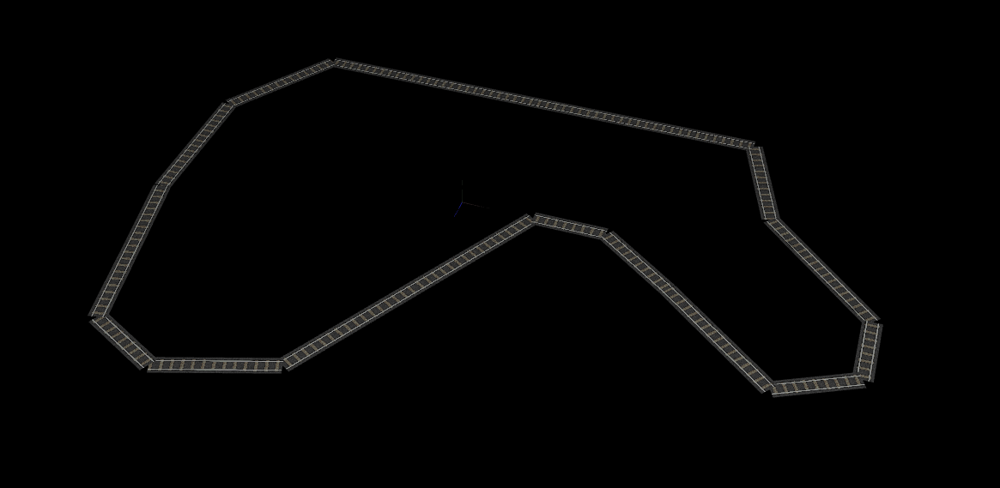
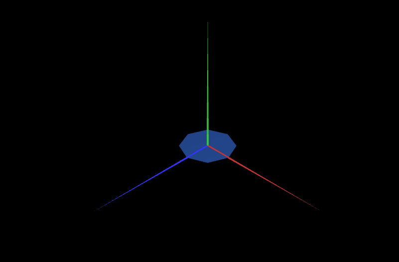
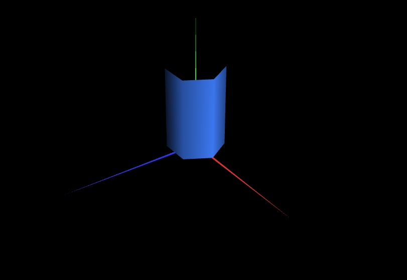
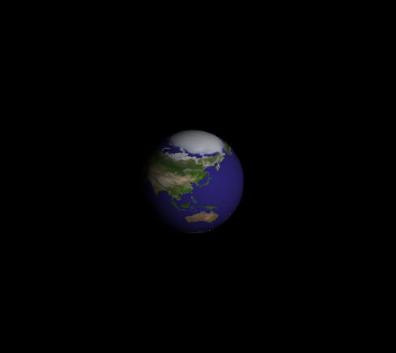
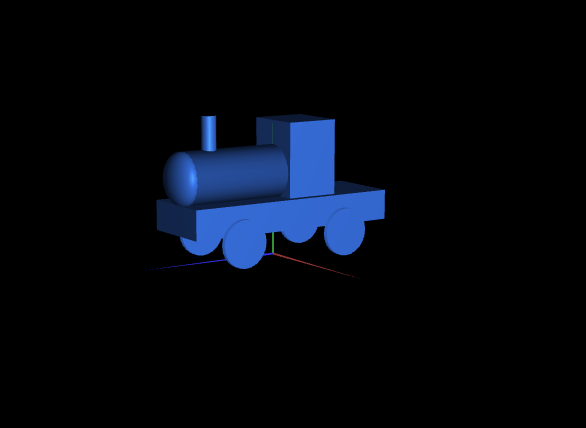
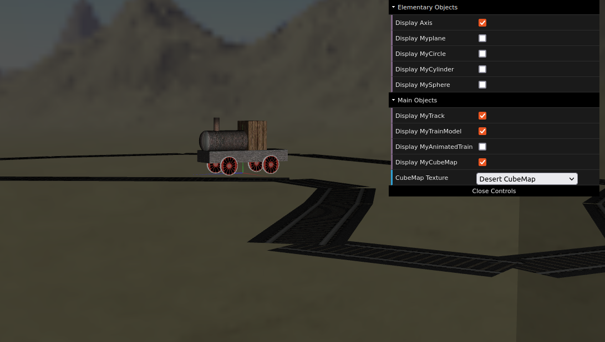
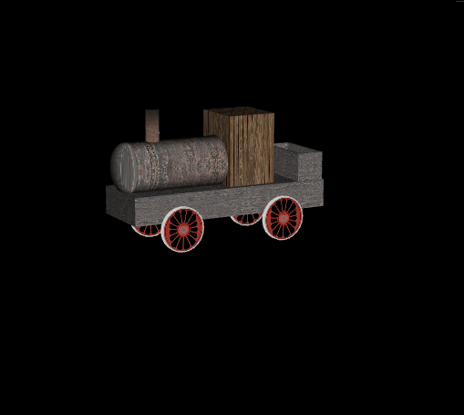
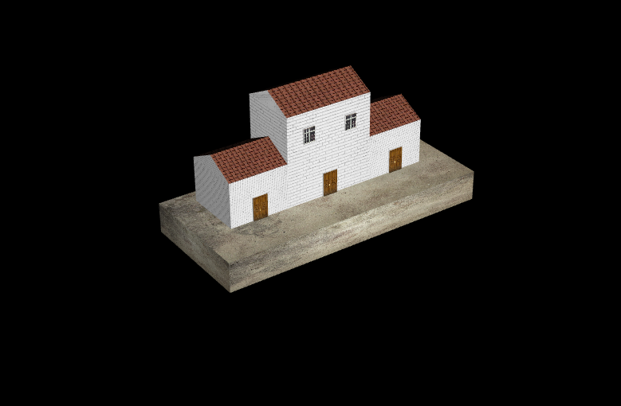
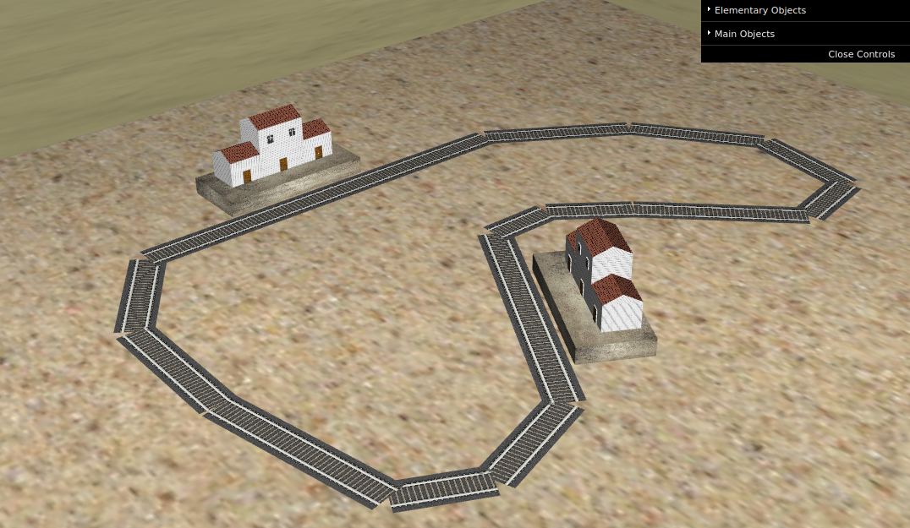

# CGRA 2021/2022

## Group T10G01
| Name             | Number    | E-Mail             |
| ---------------- | --------- | ------------------ |
| António Campelo  | 201704987 | up201704987@fc.up |

----

## Project Notes

- In commit with proj-2 tag, MyTrack was remade.
- There's a glitch on the back of MySphere duo to bad texture mapping. As of this commit (proj-2) I wasn't able to fix the issue.
- Didn't fully understand what I was suppose to do with the MyCubeMap positioning and scaling. I implemented as shown bellow, because when moving the camera the objects easily got hidden by the cubeMap. To fight this and beacause MyTrack was bigger than 50 units in leght, I increased the cubeMap x and z scale from 50 to 300:
	- this.translate( this.camera.position[0], this.camera.position[1] + (24.9 - this.camera.position[1]), this.camera.position[2] );
	- this.scale(300, 50, 300);
* MySpere texturing problem fixed. Although, for some reason, when trying other textures (other than earth), they do not work properly.

