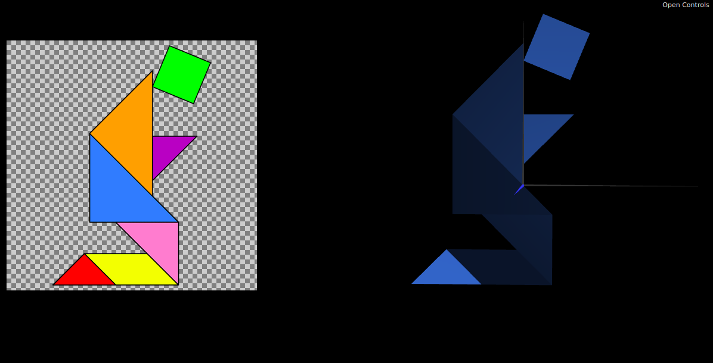
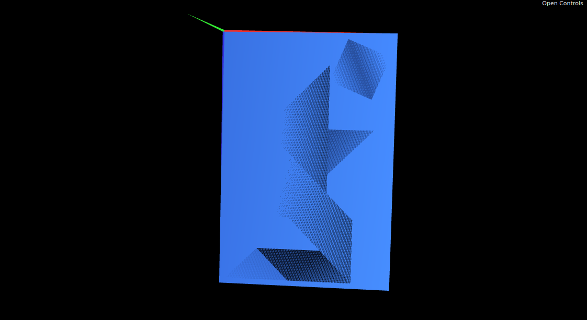
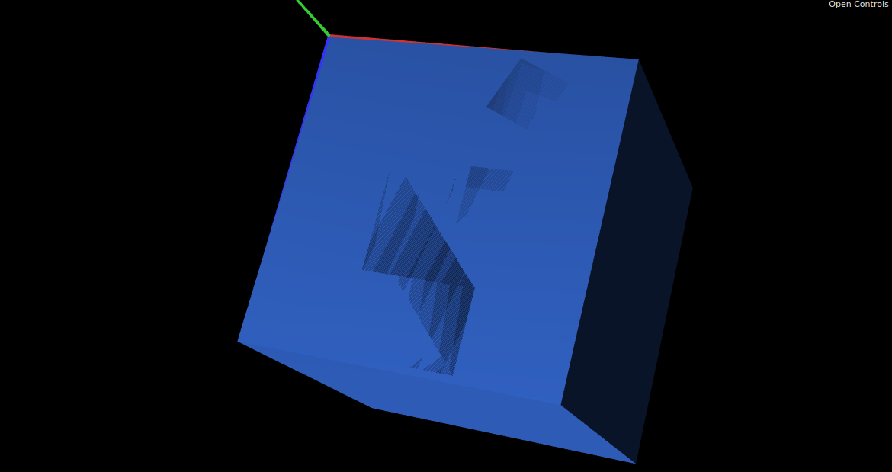

# CGRA 2021/2022

## Group T10G01

## TP 2 Notes

- In exercise 3.2, after rotating the object 180 degrees on the X axis, I modified the MyParallelogram indices in order to keep the object triangles facing the right way. I'm not sure we are suppose to change that, but I did not found an alternative.
- After the tp2-1 commit was made I noticed I made a mistake when declaring 2 objects to represent, for example, two triangles of the same size (*this.small_triangle1* and *this.small_triangle2*). This two objects should only be one. I fixed it in commit tp2-3.
- After the tp2-2 commit was made I noticed I made a mistake by making a "paralelipípedo" and not a cube as was requested. I fixed it in the tp2-3 commit.

